# How to get IronClaw in your Telegram in less than 30 seconds

It will be really fast — all you need is to prepare a few small things. The whole flow: create a Telegram bot → deploy IronClaw on NEAR AI Cloud → connect them.

---

## 1. Create a Telegram bot for your IronClaw

1. Go to [@BotFather](https://t.me/BotFather).

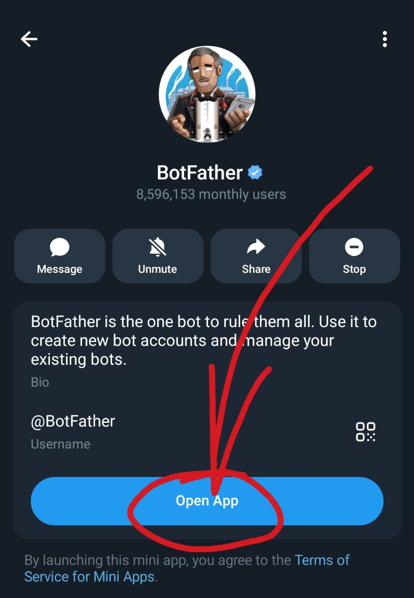

2. Open the app and create a bot.

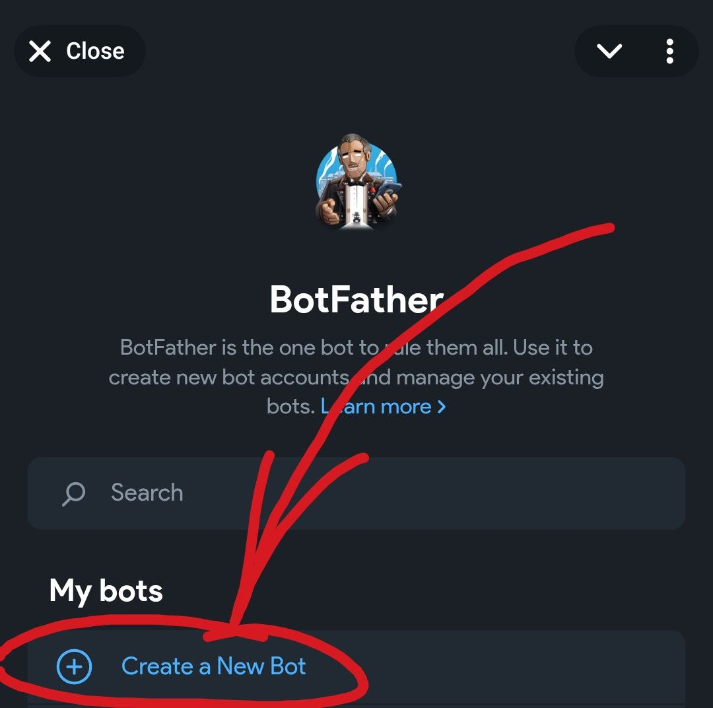

3. Add information about your bot:
   - Create a bot **Name** (it can be anything).
   - Create a bot **Username** (it must end with `bot`).
   - Click **Create Bot**.

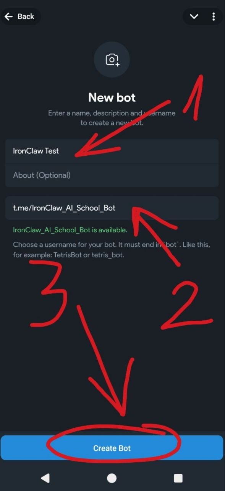

4. Copy your Telegram bot **API token** — never share it with anyone. You can always get it again (or revoke it) in BotFather.

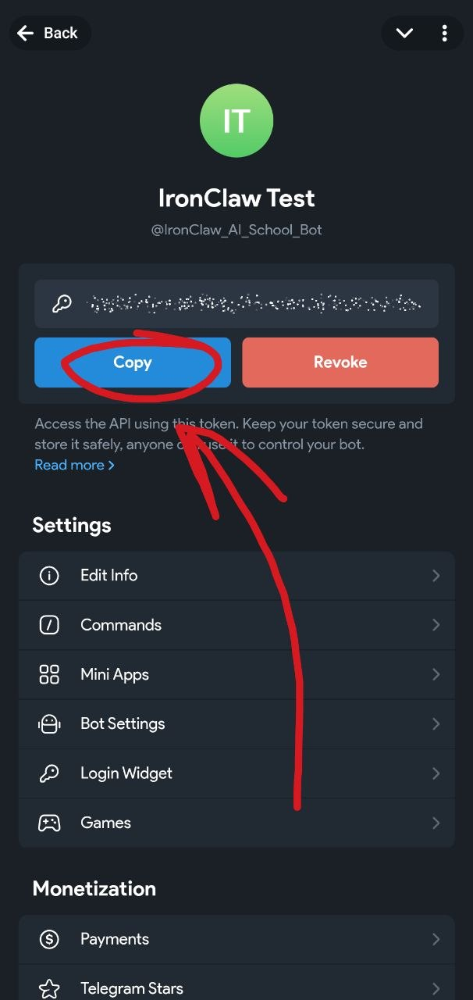

---

## 2. Deploy your IronClaw

1. Go to https://agent.near.ai and sign in the way you prefer.

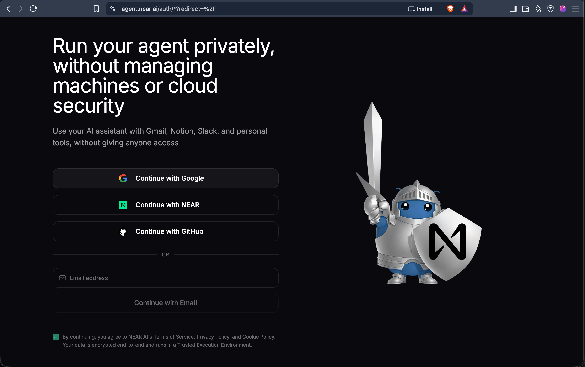

2. Choose **Starter** and complete the transaction. You will need to attach a card, but the Starter plan is free.

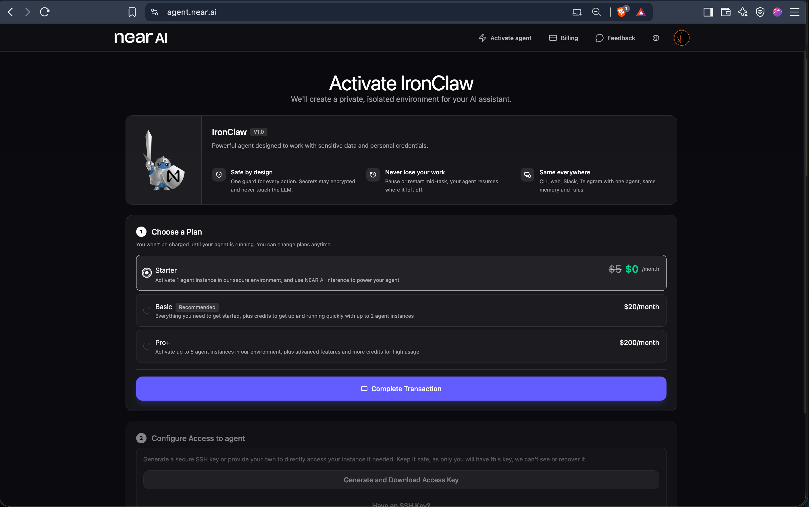

3. After the card is attached, click **Generate and Download Access Key**.

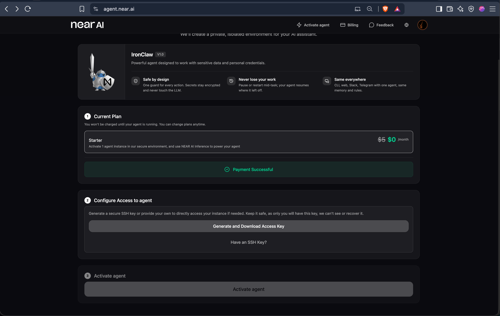

4. You will get your **Public SSH key** — you can share it. After downloading your **Private SSH key** — never share it with anyone, keep it secret. Accept that you downloaded the private keys, then click **Activate Agent**.

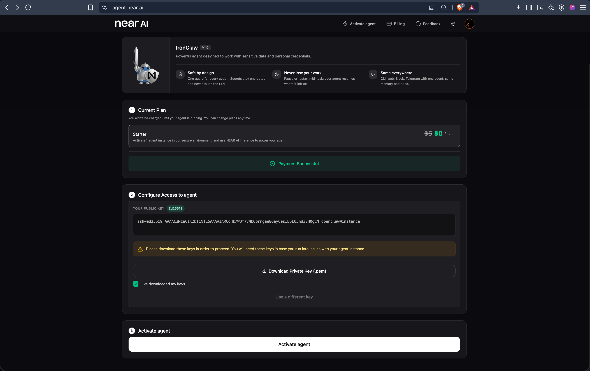

Your IronClaw agent will be ready in less than 30 seconds.

---

## 3. Connect your IronClaw to Telegram

1. Click **Open IronClaw**.

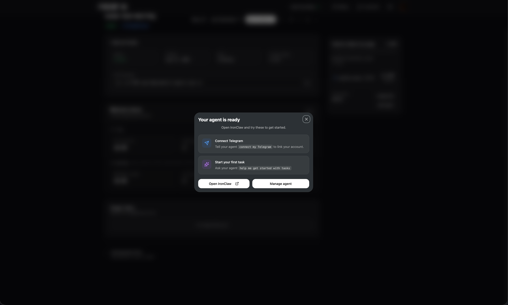

2. In the left sidebar go to **Admin → Configuration**.

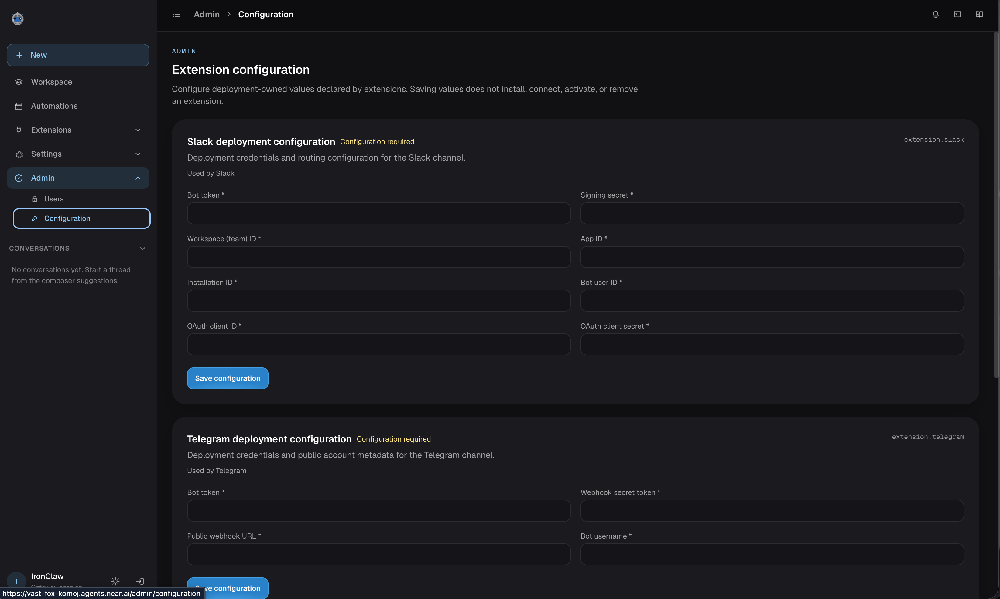

3. In **Telegram deployment configuration**, fill in the required fields.

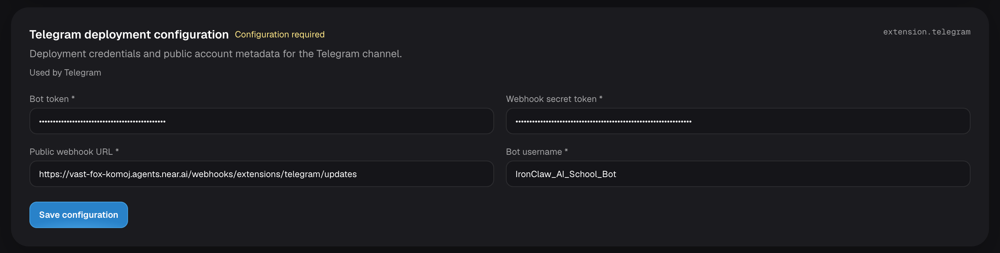

### Bot Token and Bot Username

You can get both in @BotFather (we created them in the first step). Click **Copy** and paste the token into the **Bot token** field. Add the **Bot username without the leading `@`**.


### Webhook secret token

You need a random string of digits and letters — 32 characters long. Go to https://generate-random.org/webhook-secrets and choose:

- Count = `1`
- Length = `32`
- Algorithm = `HMAC-SHA256`
- Format = `Hexadecimal`
- All extra options = off

Click **EXECUTE GENERATION**, copy the 32-character string and paste it into the **Webhook secret token** field.

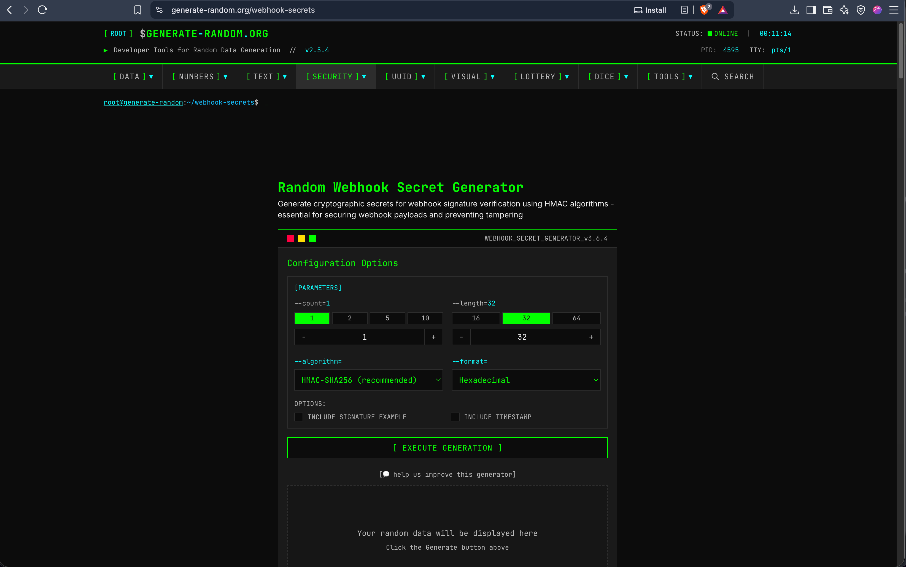

### Public webhook URL

Check the URL of your agent. In the example it's `https://vast-fox-komoj.agents.near.ai/` — you will have a different one. Add `webhooks/extensions/telegram/updates` after your agent's URL:

```
https://<your-agent>.agents.near.ai/webhooks/extensions/telegram/updates
```


After all 4 fields are filled, click **Save configuration**.

---

## 4. Install the Telegram extension and pair

1. In the left sidebar go to **Extensions**, search for **Telegram** and click **Install**.

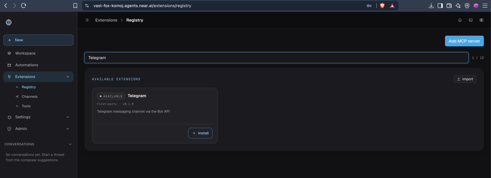

2. A new window opens. Copy the **code** (8 digits and letters). Then either scan the QR code with your phone, or click **Open in Telegram**.

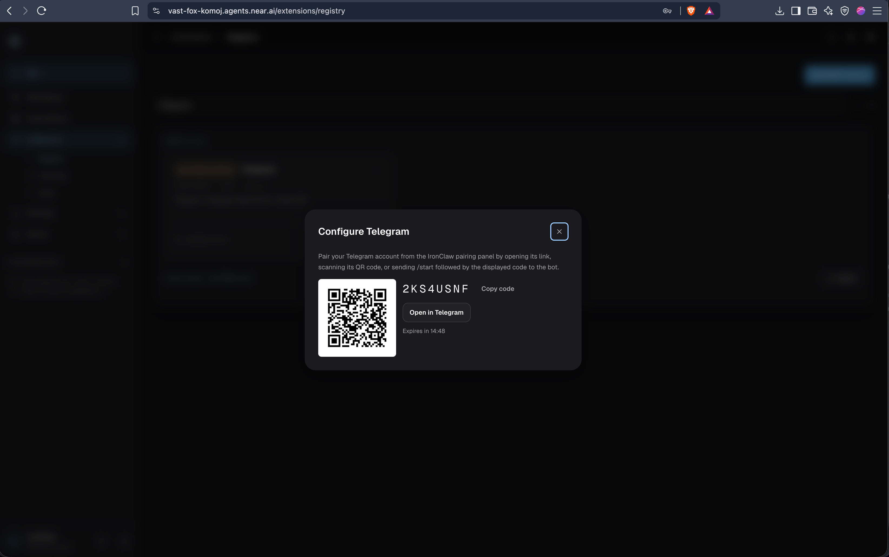

3. You will be redirected to your Telegram bot. Click **START**, then send the copied code to the bot.

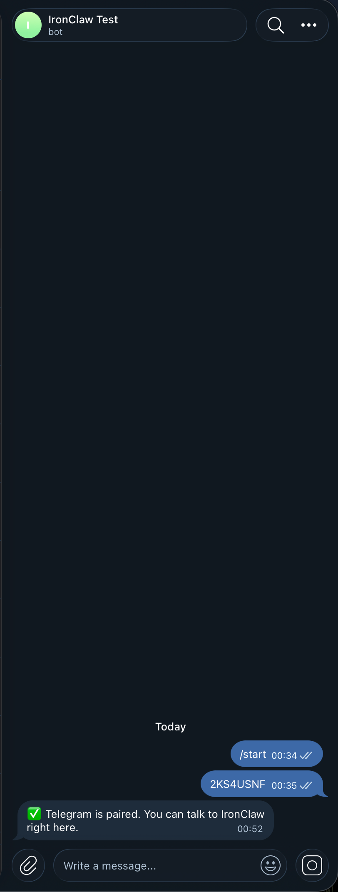

Done — your IronClaw is now in your Telegram.

---

## Troubleshooting

If your IronClaw doesn't connect after all this, go back to **Telegram deployment configuration**, paste the **Bot Token** and **Webhook Secret Token** again, click **Save Configuration**, and the bot will be paired.

---

## See also

- [ironclaw-telegram-cheatsheet.md](ironclaw-telegram-cheatsheet.md) — quick reference (NEAR AI Cloud vs self-hosted, save-failure pitfalls)
